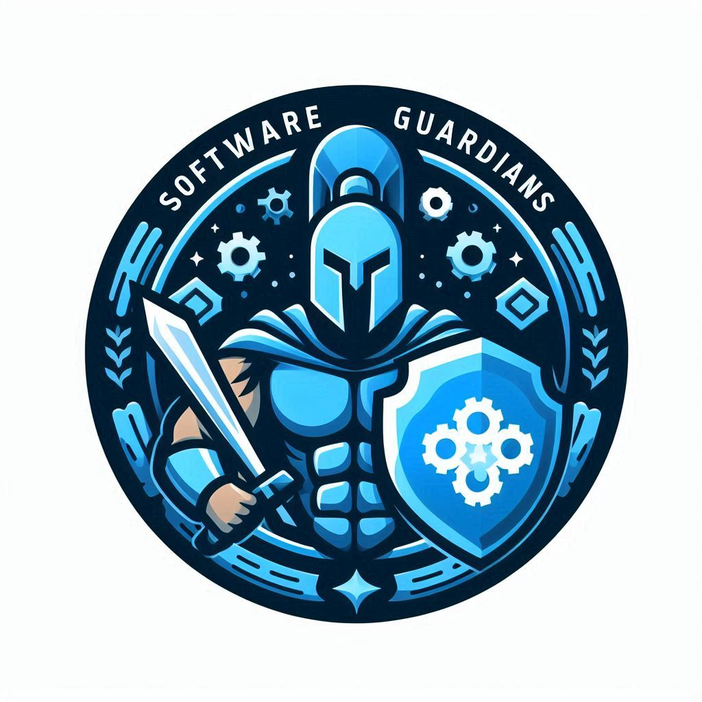

  

<h1 align="center">🛡️ Software Guardians</h1>

<em>Create, Share, and Protect Code.</em>

  
  

---

## 🎯 Our Mission

> **Software Guardians** is a developer collective focused on creating practical, reusable, and clean software structures.  
> We prioritize code quality, simplicity, and consistency across all tools and templates.

---

## 🔧 Upcoming Work

- [ ] Develop and maintain boilerplate templates for C++, Java, Python, and HTML
- [ ] Create cross-platform GUI project structures using Qt
- [ ] Implement a CLI-based project scaffolding tool
- [ ] Define contribution and code style guidelines
- [ ] Add multi-language (EN/TR) README support

---

## 🤝 Contributing

We welcome all contributors.  
To get involved:

1. Fork the repository
2. Pick an issue or suggest an improvement
3. Submit a pull request

---

<em>We don't just write code — we build a structure worth maintaining.</em>

